# Magenta

Real-time T-Mobile sentiment analysis platform combining social media scraping, geospatial visualization, and AI-powered insights.

## Architecture

```mermaid
graph TB
    subgraph Frontend["Frontend (React)"]
        Landing["Landing<br/>(WebGL)"]
        Explorer["Explorer<br/>(Deck.gl)"]
        GraphView["GraphView<br/>(D3.js)"]
    end
    
    subgraph Backend["Backend (Express + Python)"]
        API["API Server<br/>(Node.js)"]
        Twitter["Twitter<br/>Scraper"]
        Down["DownDetector<br/>Scraper"]
        
        API --> Twitter
        API --> Down
    end
    
    DB[(Supabase<br/>DB)]
    AI[Gemini<br/>AI]
    
    Frontend -->|HTTP/REST| Backend
    Backend --> DB
    Backend --> AI
    
    style Frontend fill:#1a1a2e
    style Backend fill:#16213e
    style DB fill:#0f3460
    style AI fill:#533483
```



## Tech Stack

### Frontend
- **React 18** + **TypeScript** - UI framework
- **Vite** - Build tool
- **TailwindCSS** - Styling
- **Deck.gl** - WebGL-powered 3D map visualization
- **D3.js** - Force-directed graph layout
- **OGL** - Custom WebGL galaxy background
- **Framer Motion** - Animation library
- **GSAP** - Text animation effects

### Backend
- **Express** - REST API server
- **TypeScript** - Type safety
- **Python** - Web scraping
  - `beautifulsoup4` - HTML parsing
  - `apify-client` - Twitter data collection
- **Supabase** - PostgreSQL database with RLS
- **Google Gemini** - AI text summarization

## Data Flow

```mermaid
graph LR
    Sources[Twitter/DownDetector] --> Scrapers[Python Scrapers]
    Scrapers --> Cache[Cache JSON]
    Scrapers --> DB[(Supabase DB)]
    Cache --> API[Express API]
    DB --> API
    API --> Map[Map Endpoint]
    API --> Graph[Graph Endpoint]
    Map --> Frontend[React Frontend]
    Graph --> Frontend
    
    style Sources fill:#e20074
    style Scrapers fill:#533483
    style Cache fill:#0f3460
    style DB fill:#0f3460
    style API fill:#16213e
    style Frontend fill:#1a1a2e
```



## Setup

### Prerequisites
```bash
node >= 18
python >= 3.8
```

### Environment Variables

**backend/.env**
```bash
SUPABASE_URL=your_supabase_url
SUPABASE_ANON_KEY=your_supabase_anon_key
APIFY_API_TOKEN=your_apify_token
GEMINI_API_KEY=your_gemini_api_key
PORT=3000
```

### Installation

```bash
# Backend
cd backend
npm install
pip install -r requirements.txt

# Frontend
cd ../frontend
npm install
```

### Run

**Local Development:**
```bash
# Terminal 1 - Backend
cd backend
npx tsx server.ts

# Terminal 2 - Frontend
cd frontend
npm run dev
```

Frontend: `http://localhost:5173`  
Backend: `http://localhost:3000`

**Production Deployment:**

*Frontend (Vercel):*
1. Push to GitHub
2. Import repository in Vercel
3. Set root directory: `frontend`
4. Deploy automatically

*Backend (Render):*
1. Create new Web Service on [Render](https://render.com)
2. Connect your GitHub repository
3. Configure service:
   - **Build Command**: `npm install && pip install -r requirements.txt`
   - **Start Command**: `npx tsx server.ts`
   - **Environment Variables**:
     - `SUPABASE_URL`
     - `SUPABASE_ANON_KEY`
     - `APIFY_API_TOKEN`
     - `GEMINI_API_KEY`
     - `PORT` (default: 3000)
     - `RENDER=true` (enables live data fetching)
4. Deploy from `main` branch

> **Note**: Without the `RENDER` environment variable, the backend will use cached data from the `cache/` folder for local development.

## API Endpoints

| Endpoint | Method | Description |
|----------|--------|-------------|
| `/api/trends` | GET | Trending T-Mobile topics |
| `/api/flattened` | GET | All tweets with coordinates |
| `/api/flattened/:topic` | GET | Tweets filtered by topic |
| `/api/sentiment/all` | GET | Clustered sentiment data for graph |
| `/api/summary/:topic` | GET | AI-generated topic summary |
| `/api/downdetector` | GET | Network outage timeline |

## Database Schema

```sql
tweets (
  id              bigserial PRIMARY KEY,
  tweet_id        text UNIQUE,
  text            text,
  author_username text,
  created_at      timestamp,
  likes           int,
  retweets        int,
  latitude        float,
  longitude       float,
  city            text,
  topic           text,
  sentiment       text,
  inserted_at     timestamp DEFAULT now()
)
```

## Features

### 1. Explorer View (Map)
- **3D Column Layer**: Tweet volume heatmap
- **Scatterplot Layer**: Individual tweet markers
- **City Search**: Autocomplete with geocoding
- **Topic Filtering**: Dynamic sidebar filters
- **Hover Details**: Tweet preview panel

### 2. Graph View
- **Force-Directed Layout**: D3.js clustering
- **Sentiment Analysis**: Color-coded nodes
- **Article Cards**: Expandable tweet details
- **Outage Monitor**: Real-time DownDetector chart
- **AI Summaries**: Gemini-powered explanations

### 3. Landing Page
- **WebGL Galaxy**: Custom OGL shader animation
- **Decryption Effect**: Character-by-character reveal
- **Split Text**: GSAP scroll-triggered animations

## Project Structure

```
├── backend/
│   ├── server.ts              # Express API
│   ├── twitter_generator.py   # Twitter scraper
│   ├── downdetector_scraper.py # Outage scraper
│   ├── data_orchestrator.py   # Main workflow
│   └── cache/                 # JSON cache files
├── frontend/
│   ├── src/
│   │   ├── routes/
│   │   │   ├── Landing.tsx
│   │   │   ├── Explorer.tsx
│   │   │   └── GraphView.tsx
│   │   ├── components/
│   │   │   ├── SimpleMap.tsx       # Deck.gl map
│   │   │   ├── ForceGraph.tsx      # D3 graph
│   │   │   ├── Galaxy.tsx          # WebGL background
│   │   │   └── ...
│   │   └── lib/
│   │       ├── dataTransform.ts
│   │       └── geocoding.ts
│   └── public/
└── README.md
```

## Data Collection

### Twitter Scraping
```python
# Automated via Apify
topics = [
    "T-Mobile Coverage",
    "T-Mobile Customer Service",
    "T-Mobile 5G",
    # ... 20+ topics
]
```

### DownDetector Monitoring
```python
# Scrapes outage reports every hour
# Stores: timestamp, report_count, status
```

## Visualization Details

### Deck.gl Layers
```typescript
layers = [
  new ColumnLayer({        // 3D bars for volume
    extruded: true,
    elevationScale: 50
  }),
  new ScatterplotLayer({   // Tweet points
    radiusScale: 6,
    getRadius: d => d.count
  })
]
```

### D3 Force Simulation
```typescript
simulation
  .force("link", d3.forceLink().distance(100))
  .force("charge", d3.forceManyBody().strength(-300))
  .force("collision", d3.forceCollide().radius(20))
  .force("radial", d3.forceRadial(200))
```

## Performance

- **Caching**: JSON file cache reduces API calls
- **Lazy Loading**: Route-based code splitting
- **WebGL**: GPU-accelerated rendering
- **Debouncing**: Search input optimization
- **Memoization**: React useMemo for heavy computations

## Browser Support

- Chrome/Edge 90+
- Firefox 88+
- Safari 14+

Requires WebGL 2.0 support for Galaxy component.